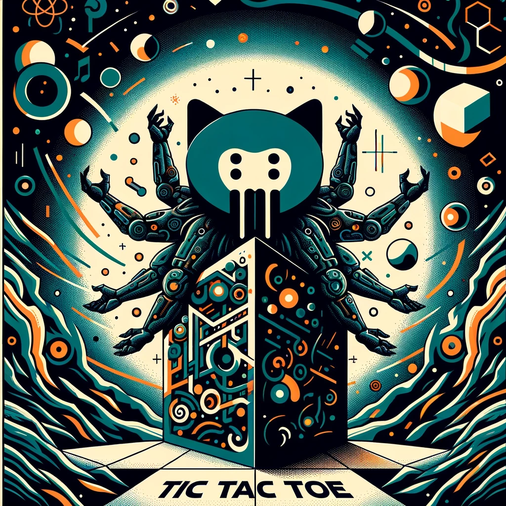

# Tic tac toe 


The goal of this project is implementing a tic tac toe RL agent in rust

## Build game 

Build dependencies

```bash 
sudo apt-get install libx11-dev libxext-dev libxft-dev libxinerama-dev libxcursor-dev libxrender-dev libxfixes-dev libpango1.0-dev libgl1-mesa-dev libglu1-mesa-dev
```

## Run game 

Runtime dependencies on Linux
```bash
apt-get install -qq --no-install-recommends libx11-6 libxinerama1 libxft2 libxext6 libxcursor1 libxrender1 libxfixes3 libcairo2 libpango-1.0-0 libpangocairo-1.0-0 libpangoxft-1.0-0 libglib2.0-0 libfontconfig1 libglu1-mesa libgl1
```

Run the game 
```bash 
./ttl_rl --gui
```

## Supported algorithms 
[] Q-learning 

## How to use 


